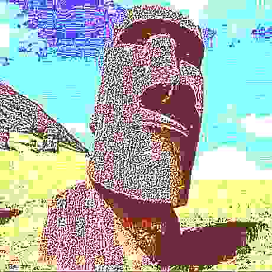

# deep-fryer

An image "deep fryer" to learn a little CUDA and parallel programming

<div>
  <a href="examples/moai.jpg">
    
  </a>
  <a href="examples/moai-fried.jpg">
    
  </a>
</div>

Examples in [examples/](examples)

Note: There's definitely a lot of optimization I could do...but I lost steam.

## Usage

```sh
./deep-fryer
# Usage: deep-fryer <IMAGE_PATH> [OUTPUT_PATH]

./deep-fryer examples/cat.png
# outputs fried image to ./out.jpg

./deep-fryer examples/moai.jpg examples/moai-fried.jpg
```

## Dependencies

- CUDA
- ImageMagick (for CImg)

## References

- https://deepfriedmemes.com/
